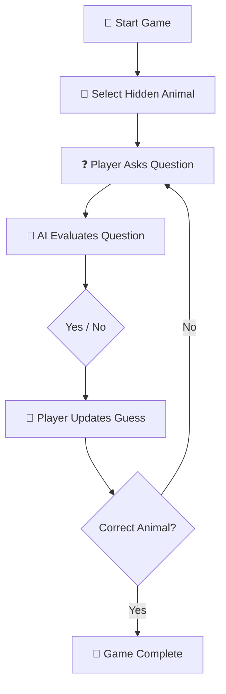

# 🐾 Guess My Animal

### Stanford University · Code in Place × Section Leader

<p align="center">
  <strong>An interactive AI-powered animal guessing game built with Python.</strong>
  <br>
  <sub>Natural-language questions · Constrained AI responses · Interactive game loop</sub>
</p>

<p align="center">
  <a href="https://www.python.org/">
    
  </a>
  
  
  
</p>

<p align="center">
  <a href="#-overview">Overview</a> ·
  <a href="#-how-it-works">How It Works</a> ·
  <a href="#-demo">Demo</a> ·
  <a href="#-technical-design">Technical Design</a> ·
  <a href="#-run-locally">Run Locally</a>
</p>

---

## 🧠 Overview

**Guess My Animal** is a small interactive Python application that combines traditional program control flow with an AI model.

The program secretly selects an animal. The player then asks questions in natural language and uses the AI's **Yes/No responses** to narrow down the possibilities before making a guess.

The project explores a simple but useful interaction pattern:

> **Deterministic program state + natural-language AI interaction**

The project was developed as part of **Stanford University's Code in Place × Section Leader** learning experience.

---

## 🎯 The Goal

The game has one simple objective:

```text
🐾 Discover the hidden animal
        ↓
❓ Ask questions
        ↓
🤖 Receive constrained AI answers
        ↓
🧠 Narrow the possibilities
        ↓
🎉 Make the correct guess
````

The player is not restricted to a predefined list of questions.

Instead, questions can be expressed naturally:

```text
"Does it have four legs?"
"Can it fly?"
"Does it live in water?"
"Is it larger than a dog?"
"Does it have fur?"
```

---

## 🔄 How It Works



### The interaction loop

**1. 🎲 Select**

A random animal is selected and kept hidden from the player.

**2. ❓ Ask**

The player enters a natural-language question.

**3. 🤖 Evaluate**

The question is provided to the AI together with the relevant hidden-animal context.

**4. ✅ / ❌ Respond**

The AI is instructed to provide a constrained **Yes/No** response without revealing the animal.

**5. 🎯 Guess**

The player continues asking questions until they identify the hidden animal.

---

## 🎬 Demo

### Example gameplay

```text
🐾 I am thinking of an animal.
Can you guess what animal it is?

Ask me a yes or no question: Does it have four legs?
Yes.

Ask me a yes or no question: Does it live in water?
No.

Ask me a yes or no question: Does it bark?
Yes.

Ask me a yes or no question: Is it a dog?
Correct! 🎉
```

### 💭 Natural-language interaction

The player can ask different types of questions:

```text
┌─────────────────────────────────────┐
│ ❓ Does it have fur?                 │
│ ❓ Can it swim?                      │
│ ❓ Does it usually live in forests? │
│ ❓ Is it larger than a dog?          │
│ ❓ Can it fly?                       │
└─────────────────────────────────────┘
                    ↓
              🤖 AI Model
                    ↓
              ┌───────────┐
              │ YES / NO  │
              └───────────┘
```

---

## 🧩 Technical Design

The project separates the **game state** from the **AI response layer**.

### Program layer

The Python program is responsible for:

```text
Animal Selection
      ↓
Game State
      ↓
User Input
      ↓
Control Flow
      ↓
Guess Evaluation
      ↓
Game Termination
```

### AI layer

The AI is responsible for interpreting natural-language questions:

```text
Player Question
      +
Hidden Animal Context
      ↓
   🤖 AI Model
      ↓
  Constrained
  Yes / No
```

This keeps the core game logic deterministic while using the AI where natural-language interpretation is useful.

---

## 🔐 Constrained AI Behavior

The AI is not used as an unrestricted conversational agent.

The prompt is designed to constrain the model to:

* evaluate whether the player's question is true for the selected animal,
* respond with **Yes** or **No**,
* avoid directly revealing the hidden animal.

Conceptually:

```text
┌───────────────────────────┐
│ Hidden Animal             │
│        +                  │
│ Player's Natural Question │
└─────────────┬─────────────┘
              ↓
        ┌────────────┐
        │  AI Model  │
        └─────┬──────┘
              ↓
       ┌──────────────┐
       │ Yes / No     │
       │ Only         │
       └──────────────┘
```

This provides a simple example of **constrained model behavior inside a conventional software workflow**.

---

## 🧪 Programming Concepts

| Concept             | Where It Appears              |
| ------------------- | ----------------------------- |
| 🐍 Python           | Core implementation           |
| 🎲 Random selection | Choosing the hidden animal    |
| 💬 User input       | Natural-language questions    |
| 🔄 Loops            | Repeated gameplay             |
| 🔀 Conditionals     | Guess and game-state logic    |
| 🧩 Functions        | Program organization          |
| 🤖 AI / LLM         | Question interpretation       |
| ✍️ Prompting        | Constraining model responses  |
| 🎯 State management | Maintaining the hidden target |

---

## 📂 Project Structure

```text
Guess-My-Animal-StanfordUniversity-CodeinPlace-SectionLeader/
│
├── main.py
├── animal.py
└── README.md
```

### `main.py`

Contains the primary game logic:

* initializes the game,
* selects the animal,
* receives player questions,
* interacts with the AI,
* checks guesses,
* controls the game loop.

### `animal.py`

Provides the random animal-selection functionality used by the game.

---

## 🚀 Run Locally

Clone the repository:

```bash
git clone https://github.com/rahulkiran2222/Guess-My-Animal-StanfordUniversity-CodeinPlace-SectionLeader.git
```

Enter the project directory:

```bash
cd Guess-My-Animal-StanfordUniversity-CodeinPlace-SectionLeader
```

Run the program:

```bash
python main.py
```

> **Note:** The AI interface used by the original Code in Place environment is part of the course/project setup. The repository therefore preserves the original project structure rather than introducing a separate API configuration.

---

## 🧠 What I Learned

This project provided a practical introduction to combining conventional programming with an AI component.

The main lessons were:

* designing an interactive program,
* maintaining program state,
* working with loops and conditionals,
* handling natural-language user input,
* integrating an AI model into a program,
* writing prompts with explicit behavioral constraints,
* separating deterministic application logic from model-generated responses.

One of the most useful design ideas was keeping the **game state under program control** while using the AI for a narrower task: interpreting the player's natural-language question.

---

## 🔬 From Game to Experiment

Although this repository is intentionally a small learning project, the underlying interaction suggests several directions for experimentation.

For example:

```text
             Guess My Animal
                    │
        ┌───────────┴───────────┐
        ↓                       ↓
   AI-based game          Rule-based game
        │                       │
        └───────────┬───────────┘
                    ↓
             Compare Results
                    │
        ┌───────────┼───────────┐
        ↓           ↓           ↓
     Accuracy    Questions   Consistency
```

Possible experiments could examine:

* the number of questions required to identify an animal,
* consistency across repeated AI responses,
* effectiveness of different prompting strategies,
* AI-based versus rule-based question answering,
* how question strategy affects successful identification.

These are **possible extensions rather than implemented features** in the current repository.

---

## 🌱 Possible Future Extensions

If the project were expanded, natural next steps would include:

* 📊 Question-count and game statistics
* 🧠 Question-history tracking
* 🎯 Candidate-animal ranking
* 🌳 Decision-tree baseline
* 🧪 Repeated-trial evaluation
* 📈 AI consistency analysis
* 🌍 Larger animal knowledge base
* 🖥️ Web or graphical interface

---

## 🎓 Learning Context

**Stanford University — Code in Place × Section Leader**

This project was developed as part of a hands-on programming experience focused on Python fundamentals and experimentation with AI-assisted interaction.

It is an **individual learning project** and is not an official Stanford software product.

---

## 📌 Project Scope

This repository is intentionally a **small educational project**, not a research benchmark or production AI system.

Its purpose is to demonstrate the progression from:

```text
Python Fundamentals
        ↓
Interactive Programming
        ↓
AI Integration
        ↓
Constrained AI Behavior
```

The project complements my larger work in AI/ML and independent research, where I focus more deeply on **LLM evaluation, foundation models, multilingual NLP, AI safety, and responsible AI**.

---

## 👨‍💻 Author

### Rahul Kiran Gunti

**AI/ML Practitioner · Independent Researcher**

Research interests:

`LLM Evaluation` · `Foundation Models` · `AI Safety` · `Multilingual NLP` · `Responsible AI`

---

<p align="center">
  🐾
  <br><br>
  <strong>Ask better questions. Think like the animal.</strong>
  <br><br>
  Built with Python + AI
  <br><br>
  <a href="https://github.com/rahulkiran2222">
    
  </a>
</p>

---

<p align="center">
  <sub>Part of my journey from programming fundamentals toward building and evaluating intelligent systems.</sub>
</p>
